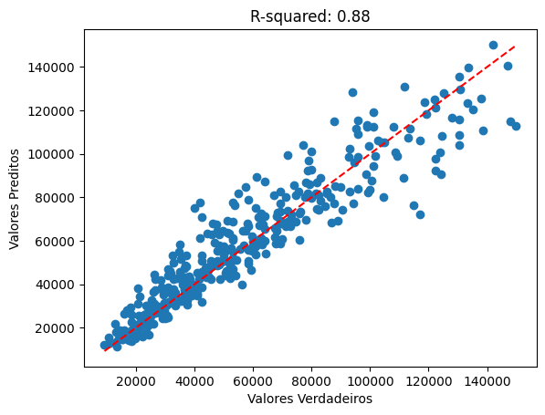
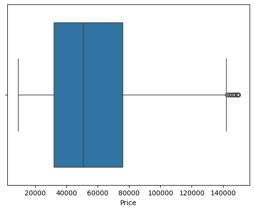

# Laptop price prediction

Aplicacao de técnicas que busca extrair, transformar e predizer os dados relacianos ao valores de laptops

## Técnicas

## Bibliotecas
* Pandas
* Seaborn
* Sklearn
* Cat Boost Regressor
* Matplotlib

## Avaliação

* Mean Squared Error: 122499879.14464653
* R-squared: 0.8827289571740422

### r-squared

### Boxplot

